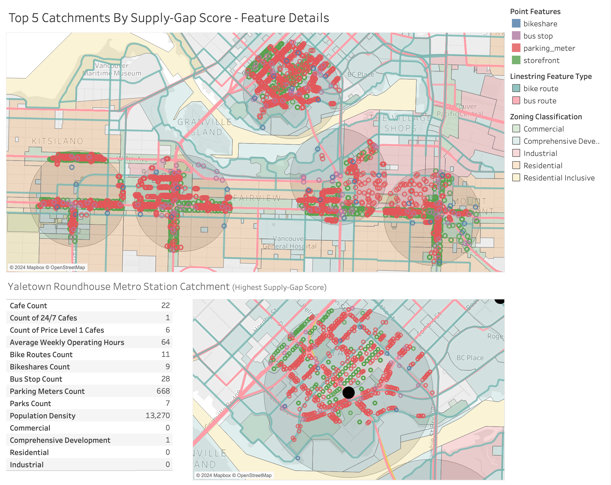

# Metro Cafe Metrics

## Introduction

This project analyzes the best metro station areas in Vancouver to open a new cafe, utilizing a range of metrics to estimate the existing supply of cafes and the potential demand within each metro station's vicinity.

To standardize the unit of analysis, "metro station vicinity" has been defined as a 500m radius catchment area around each station location.

The metrics used in this analysis are as follows:

**Supply:**
* Count of cafes
* Cafe operating hours
* Cafe price levels

**Demand:**
* Count of storefronts
* Zoning district proportions
* Neighborhood population density
* Count of bus stops
* Count of bikeshare stations (Mobi)
* Count of Bike routes
* Count of Parking Meters
* Count of Parks

## Repository Structure

The repository is structured into several directories and notebooks, each serving a specific role in the analysis:

- `data/`: Contains all datasets used in the project, categorized as `external` (raw open source data), `interim` (data used between notebooks), and `processed` (final datasets used in analysis and visualizations).
- `images/`: Holds visual aids and graphics created during the analysis.
- `notebooks/`: Includes Jupyter notebooks that detail each step of the data processing and analysis pipeline.
- `tableau/`: Contains Tableau workbooks used for analysis and visualization.

## Data Analysis Methodology

The analysis process was broken down into the following steps, with each step reflected in the notebooks within the `notebooks/` directory:

1. **Data Collection**
   * [`01_get_api_data.ipynb`:](./notebooks/01_get_api_data.ipynb)  Used APIs to collect cafe locations (Google Places API) and bikeshare station locations (Citybikes API).

2. **Data Processing**
   * [`02_process_api_data.ipynb`:](./notebooks/02_process_api_data.ipynb) Cleaned and formatted cafe data and bikeshare data. Prepared both datasets for spatial joining.
   * [`03_process_external_data.ipynb`:](./notebooks/03_process_external_data.ipynb) Retrieved and processed external data (zoning, neighborhoods, population, etc.) from sources like the City of Vancouver Open Data Portal and Abacus Open Data Network.

3. **Spatial Analysis**
   *  [`04_join_data.ipynb`:](./notebooks/04_join_data.ipynb) Executed spatial joins between metro station catchments and spatial datasets. Established supply and demand metrics by counting intersecting features.

4. **Data Merging**
   * [`05_merge_data.ipynb`:](./notebooks/05_merge_data.ipynb) Grouped spatial datasets by type and merged them into a single GeoDataFrame for Tableau visualization. 

## Analysis

For a detailed visual breakdown of individual supply and demand metrics, including, please refer to [`appendix.md`](./appendix.md). Further details regarding methodology and metric calculation can be found in the [`04_join_data.ipynb`](./notebooks/04_join_data.ipynb) notebook.

### Supply Score

The supply score is a composite metric that considers the total count of cafes within each metro station catchment area, along with additional weight given to cafes with extended operating hours or lower price levels. These factors are weighted as they are generally considered to be more competitive. Catchment areas are ranked according to their supply score, with higher scores depicted in red shades on the map. This indicates a greater supply of existing cafes in that area, and therefore a potentially lower suitability for opening a new cafe due to increased competition.

### Demand Score

The demand score is a composite metric that combines various indicators of potential customer traffic within each metro station catchment area. Each indicator is assigned a weight based on its presumed influence on cafe demand. For instance, indicators like storefronts and bus stops likely have a stronger influence than parks or bike routes. The final demand score is calculated by scaling and summing the weighted contributions of each indicator.

Catchment areas are ranked according to their demand score, as shown in the map below. The map uses a color scheme where darker colors represent higher demand scores. This suggests that areas with a darker color concentration have a greater potential customer base for cafes, due to factors like higher residential density or commercial activity. Unsurprisingly, the highest demand scores are clustered around the downtown core, with a secondary cluster south of the metro center.

## Results & Recommendations

### Supply-Gap Score
The map below combines the previously discussed supply score and demand score for each metro station catchment area. It presents station IDs alongside the corresponding scores. 

The Supply-Gap Score is a new metric calculated by subtracting the supply score from the demand score for each catchment. This value represents the relative amount of unmet demand in a particular area. In simpler terms, it highlights areas with a high potential customer base (demand) but fewer existing cafes (supply). Catchments with a higher Supply-Gap Score are shaded darker red on the map, indicating greater potential for new cafe establishments due to potentially less competition and high foot traffic.

### High-Growth Potential: Top Metro Stations Along the Broadway Extension Line
The analysis identified several metro station catchment areas with particularly high growth potential for new cafes. Interestingly, three of the top five ranked catchments are located along the Broadway Extension Line, which is currently under construction and set for completion in 2026. This suggests that these areas can expect significant increases in foot traffic once the new stations open.

The map below highlights these top 5 ranked catchments and shows their distribution on the Broadway Extension Line.

### Visualizing the Top Ranked Catchment: Yaletown-Roundhouse

Yaletown-Roundhouse Station boasts the highest Supply-Gap Score, indicating a potentially strong combination of high demand and lower competition from existing cafes. The figure below offers three perspectives to understand this catchment area in detail:

**1. Catchment Overview:**

* **Top 5 Catchments:** The larger map highlights the top 5 ranked catchments and their distribution. This provides a broader context for Yaletown-Roundhouse's position among the top contenders.
* **Illustrative Features:** Various map points represent the presence of different factors influencing foot traffic in these areas.  

**2. Yaletown-Roundhouse Close-Up:**

* **Zoomed-in Focus:** A more detailed view of Yaletown-Roundhouse provides better vantage into the specific features within its catchment boundaries. 

**3. Yaletown-Roundhouse Metric Breakdown:**

* **Supply-Gap Score Components:** A breakdown of the metrics used to calculate the Supply-Gap Score for Yaletown-Roundhouse helps understand the factors driving its high ranking.

**Next Steps:**

While this visualization offers valuable insights, refer to the full analysis in [`03_process_external_data.ipynb`](./notebooks/03_process_external_data.ipynb) / [`04_join_data.ipynb`](./notebooks/04_join_data.ipynb) for a deeper understanding of:
* The specific types of features represented by the map markers
* How each metric was calculated and its weight in determining the Supply-Gap Score.

By combining the insights from this visualization with the detailed analysis, you can gain a more comprehensive picture of the potential for a new cafe in the Yaletown-Roundhouse catchment area. 

## AI Assistance Acknowledgement

This project was developed with the assistance of AI tools to streamline the development process and refine the final product. These tools included:

* **ChatGPT**: Assisted with code suggestions, brainstorming analytical approaches, and improving the clarity of code comments and documentation.
* **GitHub Copilot**: Supported code generation, offered optimizations, and aided in refining data cleaning and analysis scripts.
* **Gemini AI**: Contributed to the quality of the README through proofreading, suggesting clearer phrasing, and improving the overall structure.

## Appendices and Additional Resources

* **Appendix:** [`appendix.md`](./appendix.md) 
* **Jupyter Notebooks:**  [`./notebooks/`](./notebooks/)
* **Dataset Sources:** [`./data/`](./data/)