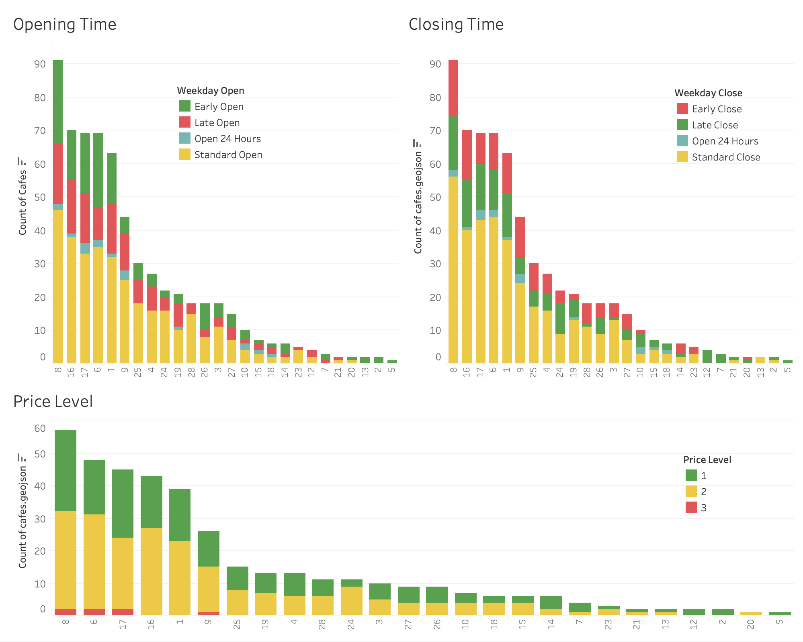

# Appendix: Breakdown of Metrics

This appendix provides a detailed explanation of the metrics used to assess cafe supply and potential demand within metro station catchments. For step-by-step code implementation and methodology, please refer to Jupyter Notebook [`04_join_data.ipynb`](./notebooks/04_join_data.ipynb).

## Supply Metrics

Supply metrics aim to quantify the level of competition from existing cafes within each catchment area.

**Cafe Count:** 
* The total number of cafes returned from Google Places within each catchment.
* Cafes overlapping multiple catchments contribute to the count of each respective catchment.

Visual reference:

**Cafe Details:**

* **Operating Hours:** Longer hours indicate a potential to serve more customers.
* **Price Level:** Price level=1 was considered the most broadly appealing.

Visual reference:

## Demand Metrics

Demand metrics estimate the potential customer base (foot traffic) within each catchment. These metrics serve as proxies for factors driving cafe patronage.

* **High-Strength Indicators:**
    * **Storefronts:** Suggest commercial activity drawing foot traffic during business hours.
    * **Bus Stops:** Indicate potential customer traffic from public transportation users.
    * **Neighborhood Density:** Higher population density implies a larger potential customer base within the catchment area. 
    

* **Medium-Strength Indicators:**
    * **Zoning Districts** '*Commercial*' and '*Comprehensive Development*' categories indicate commercial activity drawing foot-traffic.
    * **Parking Meters:** Suggest some reliance on vehicular traffic.  
    * **Bikeshare Stations:** Indicate potential customer traffic via cycling.

* **Low-Strength Indicators:**
    * **Bike Routes:** Potential for cyclists but a weaker link to cafe demand compared to other indicators.
    * **Parks:** May draw foot traffic but less consistently in connection with cafe visits.

Visualizations for each demand metric and their distribution among each catchment area can be found below:

**Storefronts**

&nbsp;

**Bus Stops**

&nbsp;

**Neighborhood Density**

&nbsp;

**Zoning Districts**

&nbsp;

**Parking Meters**

&nbsp;

**Bikeshare Stations**

&nbsp;

**Bike Routes**

&nbsp;

**Parks**

## Appendices and Additional Resources

* **Jupyter Notebooks:**  For in-depth methodology and code examples, refer to the Jupyter Notebooks: [`./notebooks/`](./notebooks/)
* **Dataset Sources:**  Explore the origins of datasets used in the project here: [`./data/`](`./data/`) 